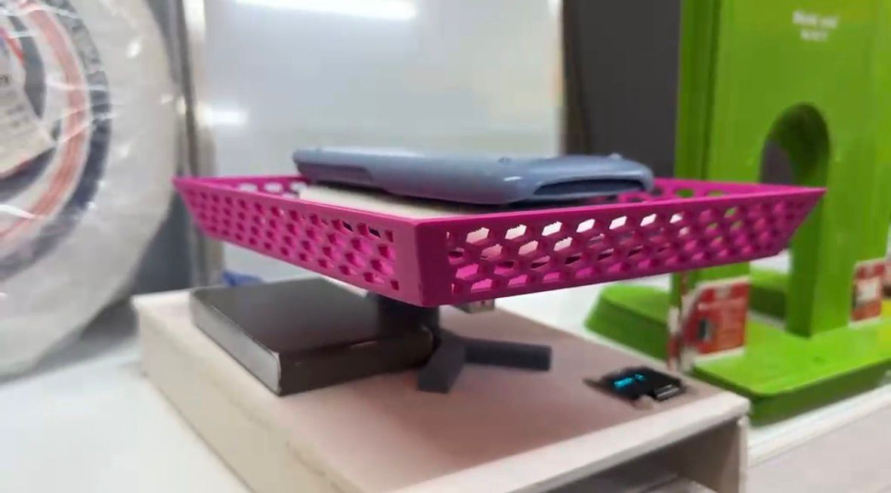
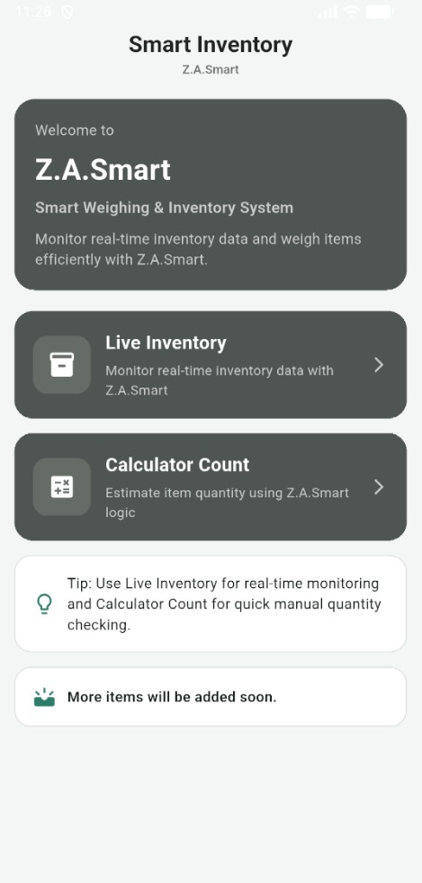
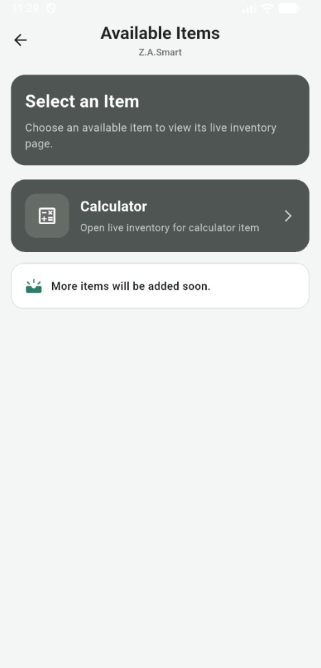
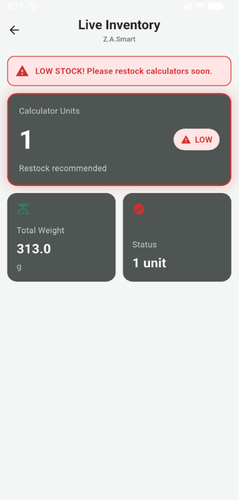

# 🎛️ Smart Inventory System (IoT-Based)
An IoT-based inventory management system that automates stock monitoring through weight measurement, sending real-time data and low-stock notifications to a mobile application.

## Problem Statement:
* **Manual Processes:** Traditional inventory checking relies heavily on manual counting, which is time-consuming and inefficient.
* **Human Error:** Small items (e.g., pens, paper packs) are easy to miscount, leading to inaccurate records and unexpected shortages.
* **Lack of Real-Time Updates:** Workers often overlook low-stock items across multiple shelves, causing delays in restocking.

## Objectives:
1. To identify the main causes of stock checking difficulties for workers and item availability awareness for customers.
2. To develop an IoT-based inventory checking system that allows customers to view stock and enables workers to receive low-stock notifications.
3. To evaluate the system's effectiveness in reducing human error and improving convenience based on user feedback.

## Scope of the Project:
* **Environment:** Implemented in a stationery shop environment for selected products/shelves.
* **Core Mechanism:** Detects stock quantity changes based on item weight using a load cell sensor.
* **Connectivity:** Sends data through WiFi to a mobile application for real-time monitoring and low-stock alerts.

## Project Limitations:
* **Weight Dependency:** Only works for items that can be measured by weight.
* **Network & Hardware:** Depends heavily on a stable WiFi connection and proper hardware calibration (Load Cell, HX711, ESP32).

---

## Technologies & Tools Used:

### Hardware Components:
* **Microcontroller:** ESP32
* **Sensors & Modules:** Load Cell (20kg), HX711 Amplifier, 0.96" OLED Display
* **Power & Structure:** Portable Power Bank (Power Supply), PVC Board
  
### Software & Frameworks:
* **Mobile App Framework:** Flutter & Dart
* **IoT Cloud Platform:** Blynk IoT
* **Development Environments (IDEs):** Arduino IDE, Android Studio Emulator, VS Code

---

## System Previews:

### Physical Prototype Setup:

### Flutter Mobile Application Dashboard:

